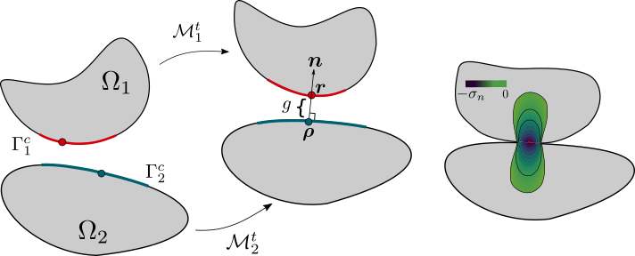

Contact Mechanics Model
=======================

The contact mechanics model is a specific implementation of
:cpp:class:`Model <akantu::Model>` interface to handle contact between
bodies.

Theory
------

.. _fig-contactmechanicsmodel-schematic:

   Basic notation for the contact between two bodies.

Let us consider two deformable bodies, represented as :math:`\Omega_\alpha`,
:math:`\alpha=1, 2`. The boundary :math:`\Gamma_\alpha` of a body is divided
into three non-intersecting regions : :math:`\Gamma^D_\alpha` with
prescribed displacements, :math:`\Gamma^N_\alpha` with prescribed tractions
and :math:`\Gamma^C_\alpha` where the two bodies :math:`\Omega_1` can potentially
come into contact such that:

.. math::
   \Gamma^D_\alpha \cup \Gamma^N_\alpha \cup \Gamma^C_\alpha =
   \Gamma_\alpha, \quad \Gamma^D_\alpha \cap \Gamma^N_\alpha \cap
   \Gamma^C_\alpha = \emptyset

   
The motion of the two bodies is described in a fixed spatial frame
defined by orthonormal basis :math:`[\boldsymbol{e}_x,
\boldsymbol{e}_y, \boldsymbol{e}_z]` by mapping
:math:`\mathcal{M}_\alpha^t` in time interval :math:`t \in [0, T]`. In
*reference* configuration :math:`i.e.~ t=0`, the position vector for
an arbitrary point on body :math:`\Omega_\alpha` is represented as
:math:`\boldsymbol{X}_\alpha` and in actual configuration the points
are denoted by small letters for example :math:`\boldsymbol{x}`.
:numref:`fig-contactmechanicsmodel-schematic` shows the motion of two
bodies from the *reference* to actual configuration. During the
motion, the bodies can potentially come in contact along
:math:`\Gamma^C_\alpha` as shown in
:numref:`fig-contactmechanicsmodel-schematic`, termed as *potential
contact zone*. Upon contact, two physical conditions need to be
satisfied :math:`(i)` the two surfaces :math:`\Gamma^C_\alpha` cannot
interpenetrate at any time during motion :math:`(ii)` forces must be
exerted by bodies along the :math:`\Gamma^C_\alpha` to resist the
interpenetration as well as relative motion along the contacting
surfaces. Of the two conditions, the non-penetration of bodies can be
defined by a *gap function* :math:`g` which represents the separation
between the two bodies:

.. math::
   g = (\boldsymbol{r} -\boldsymbol{\rho}).\boldsymbol{n}

   
where :math:`\boldsymbol{r} \in \mathcal{M}[\Gamma^C_1]` is the
position of point :math:`\boldsymbol{X}_1` at time :math:`t` ,
:math:`\boldsymbol{\rho} \in \mathcal{M}[\Gamma^C_2]` is the closest
point projection of :math:`\boldsymbol{r}` and :math:`\boldsymbol{n}`
is the outward normal at :math:`\boldsymbol{\rho}` (see
:numref:`fig-contactmechanicsmodel-schematic` b). To preclude the
interpenetration, the *gap function* is constrained with :math:`g \geq 0`, as it is shown in
\Cref{fig:body-contact}b. When the two bodies eventually come in
contact, the gap vanishes :math:`i.e.~ g=0` which leads to the
development of tractions :math:`\boldsymbol{T}_\alpha` along the
contact interface.  Thus, the boundary value problem can be formulated
for the two bodies :math:`\Omega_\alpha` with contact constraints as an
extra boundary condition:

.. math::
   \boldsymbol{T}\Big |_{{\Gamma^C}_{\alpha}} = \boldsymbol{T}_\alpha
   
Solution spaces :math:`\mathcal{U}_\alpha` and weighting spaces
:math:`\mathcal{W}_\alpha` are defined for each body:
      
.. math::
   \mathcal{U}_\alpha = \{ \boldsymbol{u}_\alpha: \Omega_\alpha \to \mathbb{R}^d ~|~ \boldsymbol{u}=\boldsymbol{u}[\boldsymbol{x}_\alpha]~ \forall~\boldsymbol{x}_\alpha \in \Gamma^D_\alpha \}

.. math::
   \mathcal{W}_\alpha = \{ \boldsymbol{w}_\alpha: \Omega_\alpha \to
   \mathbb{R}^d ~|~ \boldsymbol{w}=0~ \forall~ \boldsymbol{x}_\alpha \in
   \Gamma^D_\alpha \}

The variational form for each body :math:`\alpha` is given as

.. math::
   \int_{\Omega_\alpha}\boldsymbol{\sigma}[\boldsymbol{u}_\alpha]:\boldsymbol{\epsilon}[\boldsymbol{w}_\alpha]~d\Omega_\alpha
   =
   \int_{\Omega_\alpha}\boldsymbol{b}_\alpha.\boldsymbol{w}_\alpha~d\Omega_\alpha +
   \int_{\Gamma^C_\alpha}\boldsymbol{T}_\alpha.\boldsymbol{w}_\alpha~d\Gamma_\alpha +
   \int_{\Gamma^N_\alpha}\boldsymbol{T}_\alpha^D.\boldsymbol{w}_\alpha~d\Gamma^N_\alpha

In equilibrium state, following Newton's :math:`3^{rd}` law, it can be
stated the forces exerted by two bodies along :math:`\Gamma^C_\alpha`
are equal and opposite:

.. math::
   \boldsymbol{T}_1~d\Gamma^C_1 = - \boldsymbol{T}_2~d\Gamma^C_2

This allows to replace the two integrals over contact surfaces
$\Gamma^C_\alpha$ with a single integral over any one of the surfaces:

.. math::
   \int_\alpha
   \boldsymbol{T}_\alpha.\delta\boldsymbol{u}_\alpha~d\Gamma^C_\alpha &=
   \int_{\Gamma^C_1}\boldsymbol{T}_1\delta\boldsymbol{u}_1~d\Gamma^C_1 +
   \int_{\Gamma^C_2} \boldsymbol{T}_2\delta\boldsymbol{u}_2~d\Gamma^C_2 \\ &=
   \int_{\Gamma^C_1} \boldsymbol{T}_1(\delta\boldsymbol{u}_1 -
   \delta\boldsymbol{u}_2)~d\Gamma^C_1

The contact traction :math:`\boldsymbol{T}_1` can be decomposed into
its normal and tangential components as:

.. math::
   \boldsymbol{T}_\alpha = \boldsymbol{T}^n + \boldsymbol{T}^t
   = \sigma_n\boldsymbol{n}+ \boldsymbol{T}^t

where :math:`\boldsymbol{T}^n` is the component along the normal
vector :math:`\boldsymbol{n}` and :math:`\boldsymbol{T}^t` is the
component tangential to :math:`\boldsymbol{n}` developed due to the
friction along the surfaces. Upon contact , the normal pressure
:math:`\sigma_n` associated to :math:`\boldsymbol{T}^n` must be
compressive to preclude the interpenetration of bodies. In general, if
a point is not in contact :math:`g > 0`, then :math:`\sigma_n=0` and
in contact :math:`\sigma_n < 0`. This leads to the non-penetration
condition:

.. math::
   \sigma_n g = 0

The above set of conditions care called *Hertz-Signorini-Moreau* or
*Karush-Kuhn-Tucker* condition given as:

.. math::
   g \geq 0, \quad \sigma_n \leq 0 \quad g.\sigma_n = 0

The tangential component of the contact traction is defined as :

.. math::
   \boldsymbol{T}_t =  (\boldsymbol{I} - \boldsymbol{n} \otimes \boldsymbol{n})\boldsymbol{\sigma}

where :math:`\boldsymbol{\sigma}` is the Cauchy stress tensor and
$\boldsymbol{n}$ is the outward normal at
:math:`\boldsymbol{\rho}`. The direction of tangential traction,
:math:`\boldsymbol{s}` is determined by the relative sliding velocity
:math:`\boldsymbol{v}_t` of the point :math:`\boldsymbol{r}` and its
projection point :math:`\boldsymbol{\rho}` in contact and is given as:

.. math::
   \boldsymbol{s} = \begin{cases} \dfrac{\boldsymbol{v}_t}{\|
   \boldsymbol{v}_t \|}, & \text{ if } \| \boldsymbol{v}_t\| > 0 \\ &
   \\ 0, & \text{ if } \| \boldsymbol{v}_t\| = 0 \end{cases}

According to the experimental observations of Amontons
and~\cite{coulomb}, in presence of friction, the interface develops a
frictional strength which governs the sliding between them and thus
constrains the tangential contact. In Akantu implementation, we
restrict to the classical non-associated Coulomb's friction
law~\citep{coulomb} which is widely used in many physical and
engineering applications. The Coulomb's friction law, as a first-order
approximation, states that the frictional strength is proportional to
the normal pressure:

.. math::
   \sigma_{fric} = \mu |\sigma_n|

where :math:`\mu` is coefficient of friction between interfaces. If
the tangential traction :math:`||\boldsymbol{T}^t||` developed is
below the frictional strength, the relative tangential sliding is zero
:math:`i.e.~\boldsymbol{v}_t = 0` :

.. math::
   ||\boldsymbol{T}^t|| < \mu| \sigma_n |, \quad \boldsymbol{v}_t=0

The above equation denotes a *stick state*. As soon as the tangential
stress reaches the frictional strength, the two surfaces start
slipping relative to each other :math:`i.e.~\boldsymbol{v}_t > 0`. The
slipping of the surfaces ensures that the tangential stress does not
exceeds the frictional strength, :math:`||\boldsymbol{\sigma}_t||
-\mu|\sigma_n| = 0`. This definition of *slip state* is defined as:

.. math::
   ||\boldsymbol{\sigma}_t|| -\mu|\sigma_n| = 0, \quad
   ||\boldsymbol{v}_t|| > 0

Similar to *Karush-Kuhn-Tucker* condition for normal contact, the
above conditions formulate the necessary conditions for tangential
contact:

.. math::
   ||\boldsymbol{v}_t|| \geq 0, \quad ||\boldsymbol{T}^t||
    -\mu|\sigma_n| = 0, \quad ||\boldsymbol{v}_t||
    \Big(||\boldsymbol{T}^t|| -\mu|\sigma_n| \Big) = 0

The above contact and frictional constraints are unilateral in nature
*i.e.* they do not behave symmetrically with respect to *gap function,
g*. This renders the balance of work as a variational inequality:

.. math::
   \sum_{\alpha=1}^2
   \int_{\Omega_\alpha}\boldsymbol{\sigma}[\boldsymbol{u}_\alpha]:\boldsymbol{\epsilon}[\boldsymbol{w}_\alpha]~d\Omega_\alpha
   \geq \sum_{\alpha=1}^2 \Big \{
   \int_{\Omega_\alpha}\boldsymbol{b}_\alpha.\boldsymbol{w}_\alpha~d\Omega_\alpha +
   \int_{\Gamma^Ct_\alpha}\boldsymbol{T}_\alpha.\boldsymbol{w}_\alpha~d\Gamma_\alpha +
   \int_{\Gamma^N_\alpha}\boldsymbol{T}_\alpha^D.\boldsymbol{w}_\alpha~d\Gamma_\alpha\Big
   \}

which makes it a non-linear optimization problem. The strategy
employed (optimization techniques) to find the solution of variational
inequality depends on the choice of numerical framework employed to
solve the B.V.P.

To solve the minimization problem, FEM introduces the concept of
active set strategy to overcome the problem. In active set strategy,
it is assumed that at current solution step, the part of potential
contact zone :math:`\Gamma^C_1` that are in contact are known,
:math:`\Gamma^{C\star}_1 \subseteq \Gamma^C_1`. This
is achieved by first allowing the two bodies to interpenetrate and
finding the interpenetrated part of potential contact zone which will
denote the active set. Knowing the active set, transforms the
optimization problem to a variational equality where constraints are
imposed along the active part of contacting interface:

.. math::

   \sum_{\alpha=1}^2
   \int_{\Omega_\alpha}\boldsymbol{\sigma}[\boldsymbol{u}_\alpha]:\boldsymbol{\epsilon}[\delta\boldsymbol{u}_\alpha]~d\Omega_\alpha
   = \sum_{\alpha=1}^2 \Big \{
   \int_{\Omega_\alpha}\boldsymbol{b}_\alpha.\delta\boldsymbol{u}_\alpha~d\Omega_\alpha +
   \int_{\Gamma^N_\alpha}\boldsymbol{T}_\alpha^D.\delta\boldsymbol{u}_\alpha~d\Gamma_\alpha\Big
   \} \\
   + \int_{\Gamma^{C\star}_1
   }\boldsymbol{T}_1(\delta\boldsymbol{u}_1 -
   \delta\boldsymbol{u}_2)~d\Gamma^{C\star}_1

Thus, the resolution of contact problem in FEM requires two steps:
finding the active set along the contacting interface and then
imposing the contact constraints along the active set only. In the
following section, we describe how to employ the contact detection strategies
implemented within Akantu in order to find the active set and to compute contact forces.

Using the Contact Mechanics Model
---------------------------------

The :cpp:class:`ContactMechanicsModel <akantu::ContactMechanicsModel>`
object solves the contact problem. An instance of
the class can be created like this::

   ContactMechanicsModel contact(mesh, spatial_dimension);

while an existing mesh has been used (see \ref{sect:common:mesh}). To
intialize the model object::

  contact.initFull(_analysis_method = _explicit_lumped_mass);

The contact mechanics model contains :cpp:class:`Arrays <akantu::Array>`:

:cpp:func:`gaps <akantu::ContactMechanicsModel::getgaps>`
     contains the nodal interpenetrating value :math:`g` (positive for
     interpenetration, zero by default after initialization)

:cpp:func:`normals <akantu::ContactMechanicsModel::getNormals>`
     contains the normal vector at the slave nodes (zero by default
     after initialization).

  
In Akantu, the possible contact between surfaces is divided into 3
categories.

- Physical Surfaces - The contact occurs between two pyhsically
  defined boundaries/surfaces of a body.
- Cohesive Surfaces - The contact occurs between fracturing surfaces
  created using :cpp:class:`SolidMechanicsModelCohesive
  <akantu::SolidMechanicsModelCohesive>`.
- All Surfaces - The contact can occur between physical as well as
  cohesive surfaces.

To select the contacting surfaces, one must define a
:cpp:class:`SurfaceSelector <akantu::SurfaceSelector>` of one of the
above defined types.

To define contact between Physical surfaces, an instance of
:cpp:class:`PhysicalSurfaceSelector <akantu::PhysicalSurfaceSelector>`
is created where the mesh object (see \ref{sect:common:mesh}) is
passed as an argument::

  auto && surface_selector = std::make_shared<PhysicalSurface>(mesh);

To define contact between cohesive surfaces, an instance of
:cpp:class:`CohesiveSurfaceSelector <akantu::CohesiveSurfaceSelector>`
must be created. As the contact occurs between the cohesive facets,
therefore the mesh facet object is passed as an argument::

  auto && surface_selector = std::make_shared<CohesiveSurface>(mesh.getMeshFacets());
  

To defind contact between physical and cohesive surfaces, an instance of
:cpp:class:`AllSurfaceSelector <akantu::AllSurfaceSelector>`
must be created. As the contact occurs between the cohesive facets,
therefore the mesh facet object is passed as an argument::

  auto && surface_selector = std::make_shared<AllSurface>(mesh.getMeshFacets());

Once a surface selector is created it must be assigned to the
:cpp:class:`ContactDetector <akantu::ContactDetector>` class::

  contact.getContactDetector().setSurfaceSelector(surface_selector);
  
  
Contact detection
'''''''''''''''''

The contact detection algorithm can receive the a few parameters. It is possible to 
specify the master/slave surfaces with their string identifier. The geometrical projections
are performed with iterations which can be controlled as a classical optimization problem.
A typical detection configuration is given below: 

.. code-block::

   contact_detector [
     type = explicit		 			
     master = contact_bottom
     slave = contact_top
     projection_tolerance = 1e-10
     max_iterations = 100
     extension_tolerance = 1e-5
   ]

Contact resolution
''''''''''''''''''

The contact resolution defines the surface tractions due to contact 
both for normal and tangential contact. A typical configuration for a 
penalization formulation is as follows:

.. code-block::

   contact_resolution penalty_linear [
     name = contact_top
     mu = 0.0                      # friction coefficient
     epsilon_n = 4e5               # normal penalization
     epsilon_t = 1e5               # friction penalization
     is_master_deformable = false  # when master is rigid => computational savings
   ]

Coupling with :cpp:class:`SolidMechanicsModel <akantu::SolidMechanicsModel>`
''''''''''''''''''''''''''''''''''''''''''''''''''''''''''''''''''''''''''''

To couple the
:cpp:class:`ContactMechancisModel<akantu::ContactMechanicsModel>`
contact mechanics model with
:cpp:class:`SolidMechanicsModel<akantu::SolidMechanicsModel>` a
dedicated coupler class :cpp:class:`CouplerSolidContact<akantu::CouplerSolidContact>` is provided.

When an instance of a coupler class is created, it automatically
creates the instances of solid mechanics model and contact mechanics
model. The two objects can be retrived from the coupler class.

.. code-block:: c++

   CouplerSolidContact coupler(mesh);
   auto & solid = coupler.getSolidMechanicsModel();
   auto & contact = coupler.getContactMechanicsModel();

Simply initializing the coupler initializes the two models.

.. code-block:: c++

   coupler.initFull( _analysis_method = _explicit_lumped_mass);

However two set the material selector and the contact detector for the
two models, one must set them using directly the instance of the two
model classes.

.. code-block:: c++

   auto && selector = std::make_shared<MeshDataMaterialSelector<std::string>>(
		     "physical_names",solid);
   solid.setMaterialSelector(selector);

.. code-block:: c++

   auto && surface_selector = std::make_shared<PhysicalSurfaceSelector>(mesh);
   contact.getContactDetector().setSurfaceSelector(surface_selector);

The dumping fields/vectors belonging to the solid mechanics model and
contact mechanics model can directly be set through the coupler
class.

.. code-block:: c++

   coupler.setBaseName("contact-explicit-dynamic");
   coupler.addDumpFieldVector("displacement");
   coupler.addDumpFieldVector("normal_force");
   coupler.addDumpFieldVector("external_force");
   coupler.addDumpFieldVector("internal_force");
   coupler.addDumpField("gaps");
   coupler.addDumpField("areas");
   coupler.addDumpField("stress");

   
Finally to solve the two models :cpp:func:`solveStep
<akantu::CouplerSolidContact::solveStep>` function of coupler class must be
invoked.

.. code-block:: c++

   coupler.solveStep();

   
Coupling with  :cpp:class:`SolidMechanicsModelCohesive <akantu::SolidMechanicsModelCohesive>`
'''''''''''''''''''''''''''''''''''''''''''''''''''''''''''''''''''''''''''''''''''''''''''''

To use the contact mechanics model with cohesive elements, one must use the
:cpp:class:`CouplerSolidCohesiveContact<akantu::CouplerSolidCohesiveContact>` to
coupler the :cpp:class:`ContactMechancisModel<akantu::ContactMechanicsModel>`
with
:cpp:class:`SolidMechanicsModelCohesive<akantu::SolidMechanicsModelCohesive>`.
The initialization and invocation of the functions are similar to
:cpp:class:`CouplerSolidContact<akantu::CouplerSolidContact>` except a few
changes.

.. code-block:: c++

   solid = coupler.getSolidMechanicsModelCohesive();

   
While initializing the coupler, the nature of cohesive elements
(extrinsic/intrinsic) should need to be passed.

.. code-block:: c++

   coupler.initFull( _analysis_method = _explicit_lumped_mass, _is_extrinsic=true);

   
To ensure that cohesive elements break during an explicit insertion, one must
call the function :cpp:func:`checkCohesiveStress()
<akantu::SolidMechanicsModelCohesive::checkCohesiveStress>` after
:cpp:func:`solveStep() <akantu::SolidMechanicsModelCohesive::solveStep>`.

.. code-block:: c++

   coupler.solveStep();
   solid.checkCohesiveStress();

